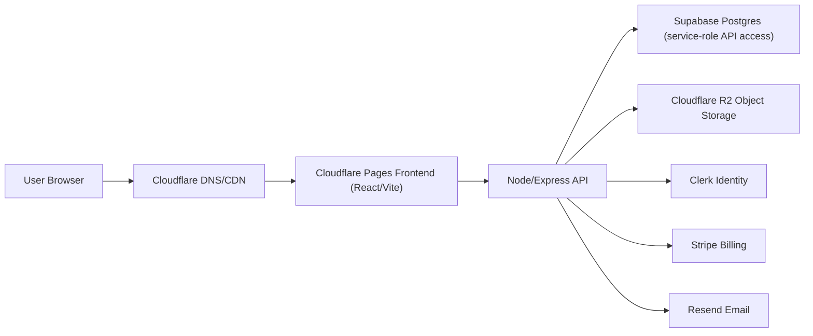

# PondBridge Security Audit and Hardening Report
Date: 2026-02-23  
Analyst scope: full-stack (frontend, API, auth, data, storage, email, billing, infra config surface)

## 1. Security Inventory

### 1.1 Architecture

### 1.2 Component inventory
- Frontend app: `apps/web` (tenant/public/admin/super surfaces)
- API app: `apps/api` (Express routes + middleware + services)
- DB schema: `apps/api/scripts/native_schema.sql`
- Auth providers:
  - Clerk (`clerk`/`hybrid` modes)
  - Legacy JWT (`legacy`/`hybrid` modes)
- Storage: Cloudflare R2 presigned PUT uploads
- Email: Resend/SMTP/mock abstraction in `apps/api/src/services/email.js`
- Billing: Stripe + webhook processor in `apps/api/src/services/billing.js`

### 1.3 PII data map
Primary PII tables (schema):
- `public.users` (email, auth linkage)
- `public.profiles` (name, email(s), phone(s), city/state, jobs, socials, avatar)
- `public.access_requests` (identity + profile payload)
- `public.invites`, `public.magic_link_tokens`
- `public.photos`, `public.messages`, `public.forum_posts`, `public.newsletters`
- `public.email_broadcasts` recipient previews

### 1.4 Roles and authorization model
- Anonymous visitor: `public` routes only
- Authenticated alumni: tenant-scoped profile/search/community routes
- Camp director (`tenant_admin`): tenant admin routes
- Platform roles: `super_admin`, `support_admin`, `finance_admin`
- Tenant source-of-truth: resolved from path/subdomain/domain in `apps/api/src/middleware/tenantContext.js`

## 2. Threat Model Summary

### Top risks assessed
1. Cross-tenant data leakage by slug/host tampering.
2. Privilege escalation into super/admin paths.
3. Token abuse (invite/magic-link replay or misuse).
4. Unauthenticated abuse surfaces (uploads, expensive parsing endpoints).
5. Billing state spoofing (client/webhook manipulation).
6. Client-side secret/token exposure.
7. Object storage exposure via predictable/public URLs.

### Highest-value attack paths
- Reusing invite or magic-link tokens across accounts/tenants.
- Calling admin/super endpoints with mismatched tenant context.
- Flooding public upload presign endpoints to abuse storage.
- Posting fake webhook events when billing runs in mock mode.

## 3. Findings Log

## Legend
- Severity: `Critical`, `High`, `Medium`, `Low`
- Status: `Fixed`, `Open`, `Accepted Risk`

### F-01 Unauthenticated resume parsing endpoint
- Severity: High
- Status: Fixed
- Evidence: `apps/api/src/routes/resume.js:35`
- Repro (before): `POST /api/t/:slug/resume/parse` without auth reached parsing path.
- Fix: Added `requireAuth` before `requireTenant` and upload middleware.
- Validation: `apps/api/tests/resumeSecurity.test.js` passes.

### F-02 Public presign endpoint allowed unrestricted scope and origin abuse
- Severity: High
- Status: Fixed
- Evidence:
  - Origin enforcement: `apps/api/src/routes/legacyCedarCompat.js:157`
  - Public scope constraints: `apps/api/src/routes/legacyCedarCompat.js:167`
  - Public endpoint gate: `apps/api/src/routes/legacyCedarCompat.js:706`
  - Authenticated presign route: `apps/api/src/routes/legacyCedarCompat.js:752`
- Repro (before): Any client could call `/uploads/presign-public` for branding scope without browser-origin checks.
- Fix:
  - Require allowed browser origin.
  - Restrict public scope elevation to valid director invite token.
  - Add authenticated `/uploads/presign` route for admin use.
- Validation:
  - `apps/api/tests/integrationsEmailR2.test.js` new checks for `UPLOAD_ORIGIN_FORBIDDEN` and `INVITE_REQUIRED`.

### F-03 Mock billing path could remain active in production misconfiguration
- Severity: High
- Status: Fixed
- Evidence:
  - Guard helper: `apps/api/src/services/billing.js:105`
  - Checkout guard: `apps/api/src/services/billing.js:409`
  - Webhook guard: `apps/api/src/services/billing.js:817`
  - Portal guard: `apps/api/src/services/billing.js:863`
  - Env flag: `apps/api/src/config/env.js`
- Repro (before): With missing Stripe keys in production, mock checkout/webhook endpoints could still process state transitions.
- Fix:
  - Added `ALLOW_MOCK_BILLING_IN_PRODUCTION=false` default.
  - Block mock checkout/webhook/portal in production unless explicitly overridden.

### F-04 Invite acceptance email lock bypass for elevated invite roles
- Severity: High
- Status: Fixed
- Evidence: `apps/api/src/routes/access.js:574`, `apps/api/src/routes/tenantAuth.js:144`
- Repro (before): Invite acceptance path allowed email mismatch in certain elevated invite flows.
- Fix: Enforce invite email lock for all invite types whenever invite email is set.

### F-05 Magic-link replay race (non-atomic consume)
- Severity: High
- Status: Fixed
- Evidence:
  - Atomic consume call: `apps/api/src/routes/tenantAuth.js:610`
  - Atomic model method: `apps/api/src/db/models/MagicLinkTokenModel.js`
- Repro (before): Concurrent consume requests could both pass read-before-write checks.
- Fix: Use atomic `consumeIfUnused` update and return conflict when already consumed.

### F-06 Legacy prelaunch unlock endpoint exposed insecure behavior
- Severity: Medium
- Status: Fixed
- Evidence: `apps/api/src/routes/legacyCedarCompat.js:720`
- Fix: Endpoint now returns `410 ENDPOINT_DISABLED`; status reflects real live/locked state.

### F-07 Super admin boundary relies on allowlist + server role enforcement
- Severity: Medium
- Status: Fixed
- Evidence:
  - Role guard + allowlist checks: `apps/api/src/middleware/requireRole.js:21`
  - Legacy super login disabled in Clerk/Hybrid: `apps/api/src/routes/superAuth.js:15`
- Fix: Server-side allowlist enforcement for super console roles and Clerk-centric flow.

### F-08 Client auth token persisted in localStorage
- Severity: Medium
- Status: Open
- Evidence: `apps/web/src/lib/storage.js:10`, `apps/web/src/lib/storage.js:23`
- Risk: XSS could exfiltrate bearer token in legacy/hybrid flows.
- Recommended remediation:
  - Move to HttpOnly secure cookie-only auth on API domain.
  - Remove token persistence from localStorage.
  - Keep only non-sensitive session UI state in storage.

### F-09 R2 read pattern still assumes public object URL
- Severity: Medium
- Status: Open
- Evidence:
  - R2 config requires `R2_PUBLIC_BASE_URL`: `apps/api/src/services/objectStorage.js:145`
  - Returned object URL is public-style: `apps/api/src/services/objectStorage.js:318`
- Risk: If bucket/CNAME is public, objects are directly retrievable by URL.
- Recommended remediation:
  - Move to private bucket + signed GET/short-lived download URLs.
  - Store object keys, not direct public URLs, in profile/media records.

### F-10 RLS policy model is service-role only (defense-in-depth gap)
- Severity: Medium
- Status: Open
- Evidence: `apps/api/scripts/native_schema.sql:629-684`
- Risk: Client-side direct Supabase access with `authenticated` role is not policy-modeled for tenant/user claims.
- Recommended remediation:
  - Add `authenticated` policies with tenant/user claim checks.
  - Add explicit policy tests with anon/auth tokens.

## 4. Hardening Changes Implemented

### API
- Added authenticated guard to resume parser endpoint.
- Added public upload abuse controls:
  - origin validation
  - restricted public scopes
  - director invite-token requirement for elevated public scope
  - authenticated presign route for admin flows
- Added production safety guard for mock billing flows.

### Frontend
- Admin branding upload now uses authenticated endpoint: `apps/web/src/pages/admin/DirectorAdminPages.jsx`
- Director onboarding branding upload now includes invite token: `apps/web/src/pages/DirectorCreateAccountPage.jsx`
- Added Cloudflare Pages browser security headers file: `apps/web/public/_headers`

### Config
- Added `ALLOW_MOCK_BILLING_IN_PRODUCTION` to env templates:
  - `.env.example`
  - `apps/api/.env.example`

## 5. Verification Report

### Automated checks
- `npm run -w apps/api lint` ✅
- `npm run -w apps/web lint` ✅
- `npm run -w apps/web build` ✅
- `npm run -w apps/api test -- --runInBand` ✅
  - 10 suites, 34 tests passed.

### Security-focused tests validated
- Tenant isolation and cross-tenant denial:
  - `apps/api/tests/tenancy.test.js`
  - `apps/api/tests/accessIsolation.test.js`
- Invite/join and idempotent membership behavior:
  - `apps/api/tests/accessIsolation.test.js`
- Fuzzy search correctness with tenant bounds:
  - `apps/api/tests/searchFuzzy.test.js`
- Email/R2 hardening checks:
  - `apps/api/tests/integrationsEmailR2.test.js`
- Resume endpoint auth + tenant scope:
  - `apps/api/tests/resumeSecurity.test.js`
- Billing/webhook idempotency and founders constraints:
  - `apps/api/tests/billingFlow.test.js`

### Client secret exposure scan
- Searched built frontend output for server secrets and common key signatures.
- No `SUPABASE_SERVICE_ROLE_KEY`, Stripe secret, Resend key, R2 secret, or Clerk secret found in `apps/web/dist`.

## 6. Security Runbook (Ongoing)

### 6.1 Rotation cadence
- Quarterly:
  - `CLERK_SECRET_KEY`
  - `SUPABASE_SERVICE_ROLE_KEY`
  - `R2_ACCESS_KEY_ID` / `R2_SECRET_ACCESS_KEY`
  - `RESEND_API_KEY`
- On integration changes/incidents:
  - `STRIPE_WEBHOOK_SECRET`

### 6.2 Pre-deploy checklist
1. Confirm `AUTH_PROVIDER` is set intentionally (`clerk` or `hybrid`) for target environment.
2. Confirm super-admin allowlist is set (`CLERK_SUPER_ADMIN_EMAILS` / user IDs).
3. Confirm `ALLOW_MOCK_BILLING_IN_PRODUCTION=false` in production.
4. Verify `_headers` is present in deployed artifact (Cloudflare Pages).
5. Run API tests + lint before deploy.

### 6.3 Continuous monitoring alerts
- Auth failures and rate-limit spikes on:
  - `/api/auth/*`
  - `/api/t/:slug/auth/*`
  - `/api/t/:slug/access/*`
- Upload abuse spikes on:
  - `/api/t/:slug/uploads/presign-public`
- Billing webhook failures:
  - `/api/webhooks/stripe`
- Export anomalies:
  - `/api/t/:slug/admin/export/*`

### 6.4 Incident response quick actions
1. Revoke active sessions (Clerk dashboard + API cookie invalidation strategy).
2. Temporarily disable invite creation and exports.
3. Rotate leaked keys immediately.
4. Review `tenant_admin_audit_logs` for blast radius and timeline.
5. Notify affected tenants if PII exposure is suspected.

## 7. Residual Risk and Next Priority Work
1. Migrate away from localStorage bearer token persistence.
2. Convert R2 access to private-by-default signed GET model.
3. Add authenticated-role RLS policies and policy-level tests for direct DB access pathways.
4. Add server-side file signature validation path for high-risk uploads (where direct upload bypasses content inspection).
